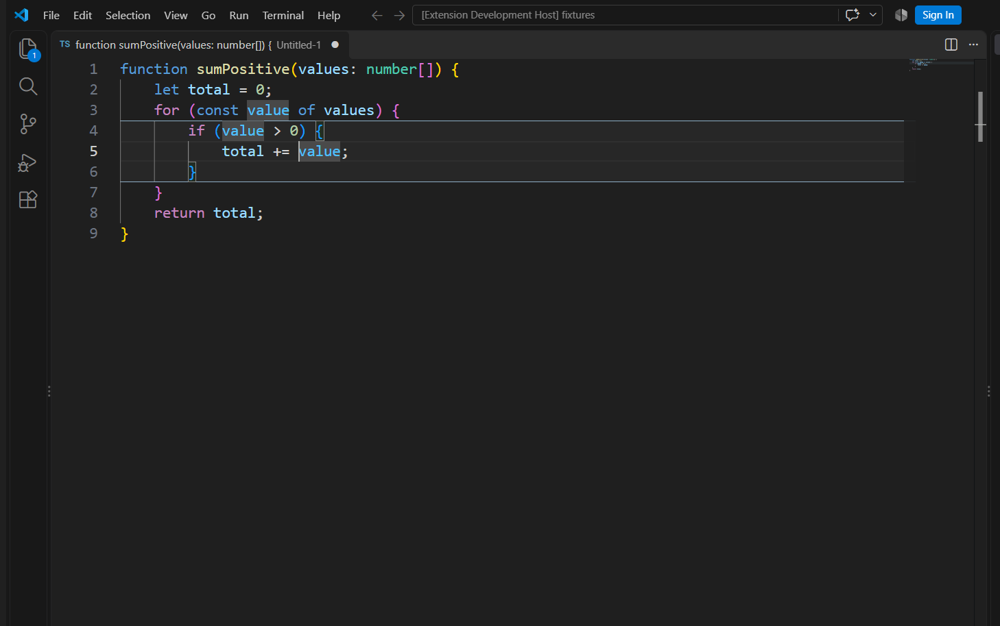

# Mark Your Scope

Mark Your Scope helps you see indentation and the syntax scope around your
cursor in Visual Studio Code. It adds subtle guides, a scope background and
start/end boundaries without changing your code or text colors.



## Supported files

| Language | Scope highlighting | Indentation |
| --- | --- | --- |
| JavaScript, TypeScript | Blocks; calls, arrays and objects in expression mode | Yes |
| Python | Functions, classes, control blocks; calls and collections in expression mode | Yes |
| JSON | Objects and arrays, only when the document parses as standard JSON | Yes |
| YAML | No syntax scope | Yes |
| Other languages | No syntax scope | Yes, unless excluded |

Plain text and Markdown are excluded by default. JSX/TSX, JSON with comments,
notebooks, diff editors, remote hosts and web extensions have not been verified
for this release. Syntax errors may suppress the affected scope; valid scopes
elsewhere can remain visible. When a document exceeds 20,000 lines or 2 MiB
of UTF-8 text, syntax analysis is skipped while visible indentation remains.

## Use

After installation, open a supported file and place the cursor inside a
function or block. Use the Command Palette (`Ctrl+Shift+P` or `Cmd+Shift+P`)
to run **Mark Your Scope** commands:

- **Choose Display Mode:** Balanced, Structure, Focus or Off.
- **Choose Palette:** preview with the arrow keys; `Esc` restores the
  previous colors. Confirm a palette, then choose User or Workspace settings.
- **Reset Palette:** remove the palette value at a chosen settings location.
- **Focus Parent Scope / Reset Scope Focus:** move through nested scopes.
- **Go to Scope Start / End:** navigate within the selected scope.
- **Select Scope:** select its text while leaving other cursors unchanged.
- **Toggle Scope Highlight:** temporarily hide or show scope decoration for
  the current window. Indentation remains visible.

Commands have no default keyboard shortcuts. Assign them in VS Code's
Keyboard Shortcuts editor if desired. The status bar names the current scope
and its line range, or explains why no scope is displayed.

## Settings

| Setting | Default | Values or effect |
| --- | --- | --- |
| `markYourScope.enabled` | `true` | Enable all decorations |
| `markYourScope.mode` | `balanced` | `balanced`, `structure`, `focus`, `off` |
| `markYourScope.indentation.style` | `line` | `line`, `background`, `off`; an explicit value overrides the mode preset |
| `markYourScope.indentation.warnings` | `off` | `mixed` marks mixed tabs/spaces; `all` also marks indentation outside tab stops |
| `markYourScope.focus.target` | `block` | `block`, `expression`, `lines` |
| `markYourScope.focus.contextLines` | `3` | Logical lines above and below the cursor in `lines` mode |
| `markYourScope.palette` | `auto` | `auto`, `darkSoft`, `lightSoft`, `highContrast`, `monochrome` |
| `markYourScope.palette.customColors` | `{}` | Optional `#RRGGBB` or `#RRGGBBAA` values for `indentLine`, `indentBandEven`, `indentBandOdd`, `scopeBalanced`, `scopeFocus`, `boundary` |
| `markYourScope.excludedLanguages` | `["plaintext", "markdown"]` | Language IDs with no decorations |

`auto` follows the active light, dark or high contrast theme. Invalid custom
colors fall back one property at a time and produce a warning. Indentation
warnings are advisory marks, not language diagnostics or automatic fixes.

The extension runs in the desktop extension host. This release was verified
on Windows x64 with VS Code 1.140.0. Other platforms and remote setups need
their own validation.

## Development

```text
npm ci
npm run check
npm test
npm run test:host
npm run package:vsix
```

The extension is licensed under
[Apache License 2.0](https://github.com/pydemia/markyourscope/blob/main/LICENSE).
Bundled dependency notices are in
[THIRD_PARTY_NOTICES.md](https://github.com/pydemia/markyourscope/blob/main/THIRD_PARTY_NOTICES.md).
